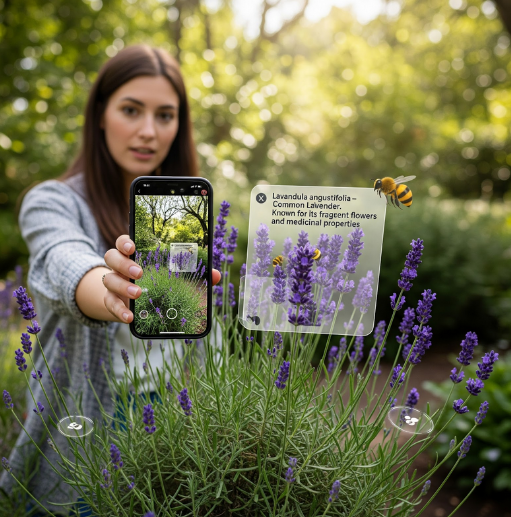

# 🌱 Plant Possibilities (v2.6)

Discover your plant's potential! **Plant Possibilities** is a beautiful, responsive web app that uses Google's Gemini AI to identify plants from photos and share interesting botanical facts.



## 🚀 Live Demo
**Try it here**: [https://lakshmipcc.github.io/plant_possibilities/](https://lakshmipcc.github.io/plant_possibilities/)

---

## 🏗️ How it Works (The "Brain" & "Beauty")

To a novice programmer, this app might look like magic, but it's built on a modern "Secure Server" architecture. Here's the breakdown:

1.  **The Face (Flutter Frontend)**: This is what you see. It's built with **Flutter**, a tool for making pretty apps. It handles the buttons, the camera, and showing you the results.
2.  **The Brain (Firebase Cloud Functions)**: To keep secret keys safe, we don't put them in the app itself. Instead, the app talks to a secure "Cloud Function" (a piece of code running on Google's servers) which holds the master key.
3.  **The Expert (Google Gemini AI)**: The Cloud Function talks to Google's AI. Our **Model Negotiator** automatically picks the fastest and smartest AI model available to identify your plant.

---

## ✨ Features

- **📱 App-Like Experience**: Works on iPhone and Android just like a real app (this is called a PWA!).
- **📸 Snapshot Identification**: Take a photo or upload one from your gallery.
- **🤖 Smart AI Selection**: Automatically tries different AI versions to make sure you get an answer.
- **🌿 Beautiful Design**: A calming "Earth-Toned" look using Sage Green and Terracotta.

## 🛠️ Tech Stack

- **Flutter**: The app framework (Dart language).
- **Firebase**: The secure backend (Node.js/JavaScript).
- **Google Gemini**: The AI engine.
- **GitHub Actions**: Automatically deploys the app when we make changes.

---

## 🚀 Getting Started

If you're a beginner wanting to run this yourself:

### 1. Prerequisites
- Install [Flutter](https://docs.flutter.dev/get-started/install).
- Get a Gemini API Key from [Google AI Studio](https://aistudio.google.com/).
- Set up a [Firebase Project](https://console.firebase.google.com/).

### 2. Local Setup
1.  **Clone the project** to your computer.
2.  **Install Firebase Tools**: `npm install -g firebase-tools`
3.  **Login**: `firebase login`
4.  **Set your API Key** in Firebase:
    ```bash
    firebase functions:secrets:set GEMINI_API_KEY
    ```
    (Paste your key when prompted).

### 3. Run Locally
To run the app on your computer:
```bash
flutter run -d chrome
```

---

## 💡 Novice Corner

- **PWA (Progressive Web App)**: A website that can be "installed" on your home screen and feels like a regular app.
- **Cloud Function**: A small piece of code that runs "in the cloud" instead of on your device. It's safer for handling private keys.
- **Dart-Define**: A way to pass information (like a setting) into the app while it's building.

## 🤝 Contributing
Feel free to fork this project and add your own plant-tastic features!

---
*Created with ❤️ by lakshmipcc*
